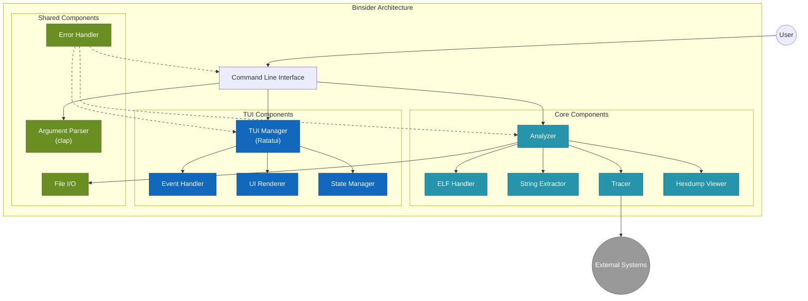

# Architecture

Here is an architectural diagram of `binsider` which should help in understanding the various components and how they interact with each other:

```mermaid
graph TB
    User((User))
    ExternalSystems((External Systems))

    subgraph "Binsider Architecture"
        CLI["Command Line Interface"]

        subgraph "Core Components"
            Analyzer["Analyzer"]
            ELFHandler["ELF Handler"]
            StringExtractor["String Extractor"]
            Tracer["Tracer"]
            HexdumpViewer["Hexdump Viewer"]
        end

        subgraph "TUI Components"
            TUIManager["TUI Manager<br/>(Ratatui)"]
            EventHandler["Event Handler"]
            UIRenderer["UI Renderer<br/>"]
            StateManager["State Manager"]
        end

        subgraph "Shared Components"
            ErrorHandler["Error Handler"]
            FileIO["File I/O"]
            ArgParser["Argument Parser<br/>(clap)"]
        end
    end

    User --> CLI
    CLI --> Analyzer
    Analyzer --> ELFHandler
    Analyzer --> StringExtractor
    Analyzer --> Tracer
    Analyzer --> HexdumpViewer
    CLI --> TUIManager
    TUIManager --> EventHandler
    TUIManager --> UIRenderer
    TUIManager --> StateManager
    CLI --> ArgParser
    Analyzer --> FileIO
    Tracer --> ExternalSystems

    ErrorHandler -.-> CLI
    ErrorHandler -.-> Analyzer
    ErrorHandler -.-> TUIManager

    classDef core fill:#2694ab,stroke:#1a6d7d,color:#ffffff
    classDef tui fill:#1168bd,stroke:#0b4884,color:#ffffff
    classDef shared fill:#6b8e23,stroke:#556b2f,color:#ffffff
    classDef external fill:#999999,stroke:#666666,color:#ffffff

    class Analyzer,ELFHandler,StringExtractor,Tracer,HexdumpViewer core
    class TUIManager,EventHandler,UIRenderer,StateManager tui
    class ErrorHandler,FileIO,ArgParser shared
    class ExternalSystems external

    %% Dotted lines for optional connections
    linkStyle 13,14,15 stroke-dasharray: 5 5
```
