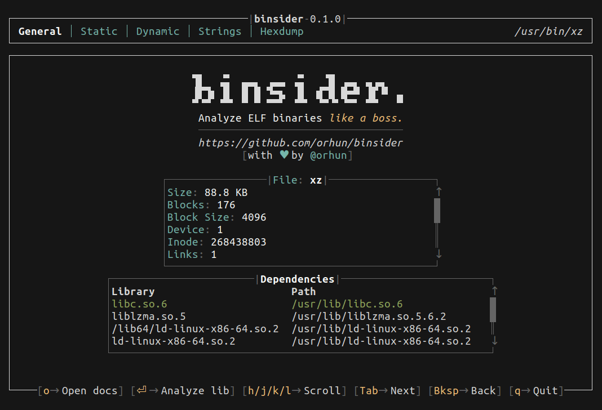
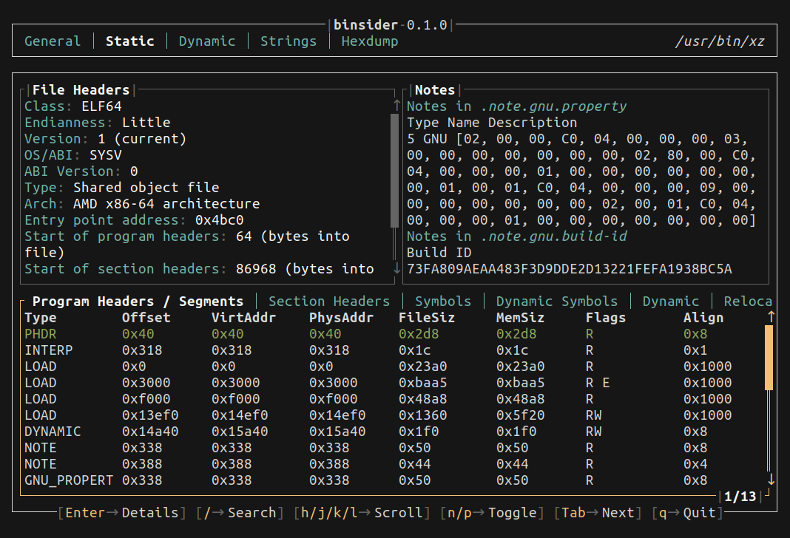
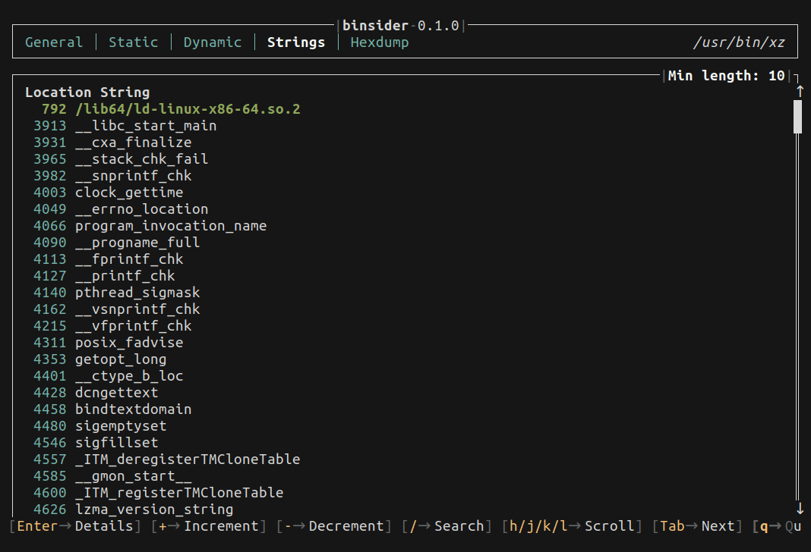
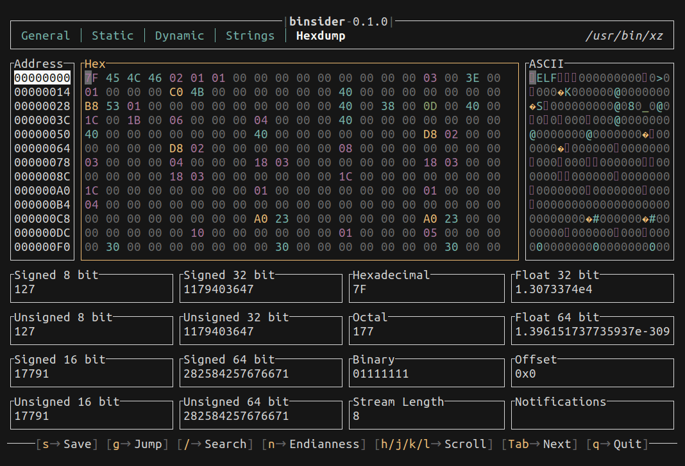

<p align="center">
    </a>
    </a>
    <br>
    </a>
    </a>
    <br>
    <br>
    <em>"Swiss army knife for reverse engineers."</em>
    <br>
    <br>
    <a href="https://github.com/orhun/binsider/releases">
        </a>
    <a href="https://crates.io/crates/binsider/">
        </a>
    <br>
    <a href="https://github.com/orhun/binsider/actions?query=workflow%3A%22CI%22">
        </a>
    <a href="https://github.com/orhun/binsider/actions?query=workflow%3A%22CD%22">
        </a>
    <a href="https://hub.docker.com/r/orhunp/binsider">
        </a>
    <a href="https://docs.rs/binsider/">
        </a>
    <br>
    <a href="https://discord.gg/zphNxEcEK7">
        </a>
</p>

<h4 align="center">
  <a href="https://binsider.dev/getting-started/">Documentation</a> |
  <a href="https://binsider.dev/">Website</a>
</h4>

😼🕵️‍♂️ **Binsider** can perform static and dynamic analysis, inspect strings, examine linked libraries, and perform hexdumps, all within a user-friendly terminal user interface!

## Quickstart

> [!TIP]
> Watch the quickstart video to get a glimpse of what `binsider` can do: [https://youtu.be/InhVCQoc5ZE](https://youtu.be/InhVCQoc5ZE)

Install `binsider` with `cargo`:

```bash
cargo install binsider
```

> [!NOTE]  
> See the other [installation methods](https://binsider.dev/installation/other/) 📦

After the installation, you are pretty much set! 💯

Just dive into the binaries by running `binsider`:

```bash
binsider <binary>
```


## Features

> [!NOTE]  
> The detailed documentation is available at <https://binsider.dev> 📚

### General Analysis

You can retrieve general binary file information, including file size, ownership, permissions, date, and linked shared libraries (similar to [`stat(1)`](https://www.man7.org/linux/man-pages/man1/stat.1.html) and [`ldd(1)`](https://www.man7.org/linux/man-pages/man1/ldd.1.html)).

[](https://binsider.dev/usage/general-analysis)

➡️ <https://binsider.dev/usage/general-analysis>

### Static Analysis

You can analyze the ELF layout (such as sections, segments, symbols, and relocations) and navigate through them to get an in-depth understanding of the binary.

[](https://binsider.dev/usage/static-analysis)

➡️ <https://binsider.dev/usage/static-analysis>

### Dynamic Analysis

It is possible to execute the binary and trace the system calls, signals, and the program's execution flow similar to [`strace(1)`](https://man7.org/linux/man-pages/man1/strace.1.html) and [`ltrace(1)`](https://man7.org/linux/man-pages/man1/ltrace.1.html).

[](https://binsider.dev/usage/dynamic-analysis)

➡️ <https://binsider.dev/usage/dynamic-analysis>

### String Extraction

Similar to the [`strings(1)`](https://linux.die.net/man/1/strings) command, `binsider` is able to extract strings from the binary file with the purpose of discovering interesting strings such as URLs, passwords, and other sensitive information.

[](https://binsider.dev/usage/strings)

➡️ <https://binsider.dev/usage/strings>

### Hexdump

`binsider` provides a rich dashboard along with a hexdump view to analyze the binary content in a structured manner.

[](https://binsider.dev/usage/hexdump)

➡️ <https://binsider.dev/usage/hexdump>

## Acknowledgements

Shoutout to [Harun Ocaksız](https://instagram.com/harunocaksiz) for sticking with me during our military service in the summer of 2024 and creating the awesome **binsider** logo! (o7)

## Contributing

See the [contribution guidelines](CONTRIBUTING.md).

<a href="https://discord.gg/zphNxEcEK7">
   </a>

## License

Licensed under either of [Apache License Version 2.0](./LICENSE-APACHE) or [The MIT License](./LICENSE-MIT) at your option.

🦀 ノ( º \_ º ノ) - respect crables!

## Copyright

Copyright © 2024, [Orhun Parmaksız](mailto:orhunparmaksiz@gmail.com)
