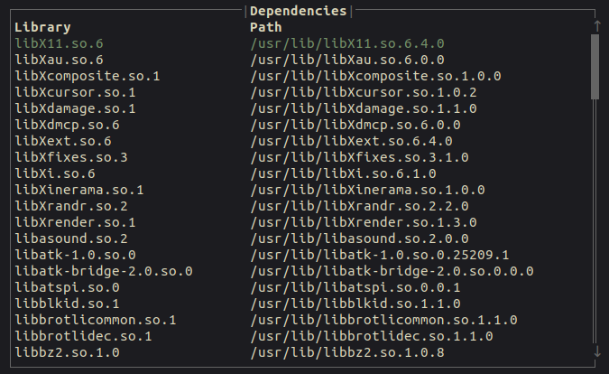

:::tip[😼]


`binsider` is a terminal UI tool for analyzing the binary files.

Take a look at the [documentation](https://binsider.dev/) if you are new around here 😎

:::

### Stats

It's been only two weeks and `binsider` already reached **1.7k** stars on [GitHub](https://github.com/orhun/binsider):

<a href="https://star-history.com/#orhun/binsider&Date">
 <picture>
   
   
 </picture>
</a>

<br/>

Analytics from [Umami](https://umami.orhun.dev/share/Zbh61KU5IaDT4DiZ/binsider.dev):


I would like to thank everyone who supported the project by starring, sharing, and contributing! 🖤

### Discord

I created a Discord server for discussing the development, features, and issues:

<a href="https://discord.gg/zphNxEcEK7">
   </a>

If you are a reverse engineering enthusiast, Rust developer, or just curious about the project, feel free to join the server by clicking the link above!

## What's new?

Click [here](https://github.com/orhun/binsider/blob/main/CHANGELOG.md) for the full changelog.

### Better platform support

The [dynamic analysis feature](/usage/dynamic-analysis) is now optional and gated behind the `dynamic-analysis` feature flag.

This change allows `binsider` to run on platforms where the dynamic analysis is not supported, e.g., macOS and Windows.

To build, run the following command:

```bash
cargo build --no-default-features
```

### Run with args

Now it is possible to [dynamically analyze](/usage/dynamic-analysis) binaries with their CLI arguments. This feature is useful for analyzing binaries that require specific arguments to run correctly, e.g:

```sh
binsider "python test.py"
```

### Nix flake

I know y'all like Nix, so we have a Nix flake for `binsider` now! ❄️

```bash
nix run "github:orhun/binsider"
```

### As a library

`binsider` is now available as a Rust library if you want to integrate it into your TUI/Ratatui project!

```toml
[dependencies]
binsider = "0.1"
ratatui = "0.28"
```

See the [documentation](/extras/library/) for more information.

### Improved white theme support

Moths and other creatures that prefer light themes can now enjoy `binsider` too! 🦋

We now check the background color of the terminal and use appropriate accent colors. (e.g. white text on a black background)

### Reorder symbol table

The symbols and dynamic symbols table in [static analysis](/usage/static-analysis) are now reordered for better readability:

- Name, Type, Value, Size, Bind, Visibility, Ndx
- Name, Requirements, Type, Value, Size, Bind, Visibility, Ndx


### Sorted shared libraries

The shared libraries in the [general analysis](/usage/general-analysis) are now sorted alphabetically for better readability.



### Squashed bugs

- _(dynamic)_ Fix locating the binary ([#48](https://github.com/orhun/binsider/pull/48))
- _(strings)_ Replace unicode whitespace for correct rendering ([#28](https://github.com/orhun/binsider/pull/28))
- _(file)_ Do not panic if creation time is not supported ([#25](https://github.com/orhun/binsider/pull/25))
- _(tui)_ Stop the event handler on quit ([#24](https://github.com/orhun/binsider/pull/24))
- _(flake)_ Fix test failure on Nix ([#30](https://github.com/orhun/binsider/pull/30))
- _(test)_ Ensure that binary is built before the test runs ([#11](https://github.com/orhun/binsider/pull/11))

## What's next?

| Issue                                              | Title                                                                            | Importance  | Type    |
| -------------------------------------------------- | -------------------------------------------------------------------------------- | ----------- | ------- |
| [#43](https://github.com/orhun/binsider/issues/43) | Tracing system call error: ESRCH: No such process                                | Help Needed | Bug     |
| [#35](https://github.com/orhun/binsider/issues/35) | Support displaying general file information on Windows                           | Help Needed | Feature |
| [#17](https://github.com/orhun/binsider/issues/17) | Print the list of linked libraries as a tree and indicate how they were resolved | Medium      | Feature |
| [#45](https://github.com/orhun/binsider/issues/45) | Support searching for shared libraries                                           | Medium      | Feature |
| [#22](https://github.com/orhun/binsider/issues/22) | Sort Symbols by Name or Address                                                  | Medium      | Feature |
| [#7](https://github.com/orhun/binsider/issues/7)   | Support tweaking dynamic analysis options                                        | Medium      | Feature |
| [#5](https://github.com/orhun/binsider/issues/5)   | Improve the test suite                                                           | Medium      | Feature |
| [#47](https://github.com/orhun/binsider/issues/47) | Human readable output for static analysis                                        | Easy        | Feature |
| [#6](https://github.com/orhun/binsider/issues/6)   | Launch TUI from selected tab                                                     | Easy        | Feature |

Research:

| Issue Number                                       | Title                           |
| -------------------------------------------------- | ------------------------------- |
| [#46](https://github.com/orhun/binsider/issues/46) | Support diffing binaries        |
| [#26](https://github.com/orhun/binsider/issues/26) | Support more platforms via LIEF |
| [#16](https://github.com/orhun/binsider/issues/16) | Binwalk/unblob                  |

#### Reproducible builds

#### Support the development
