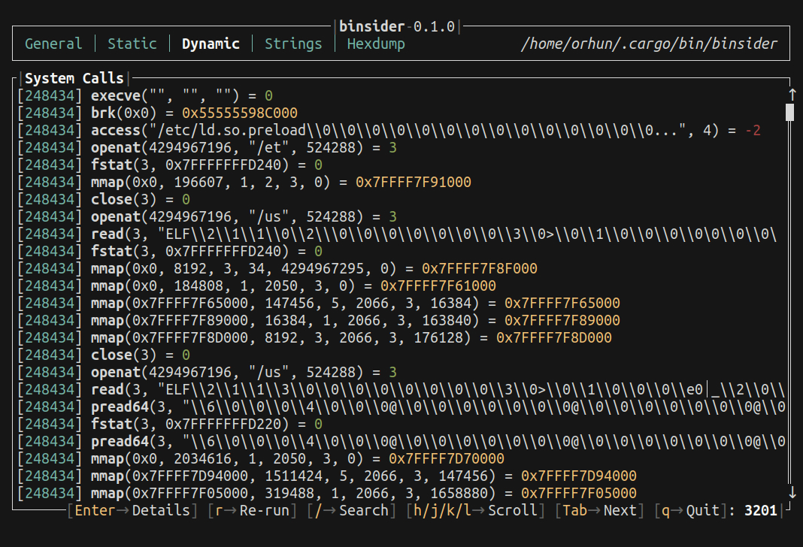
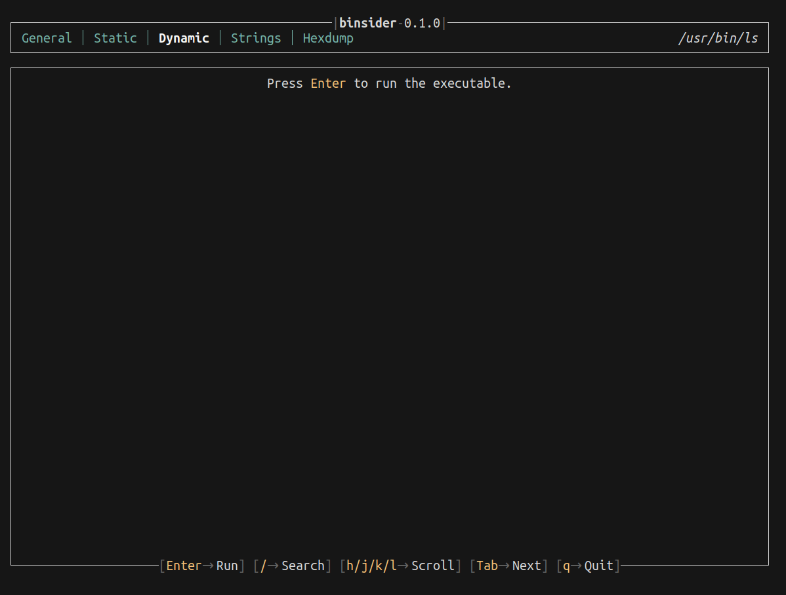
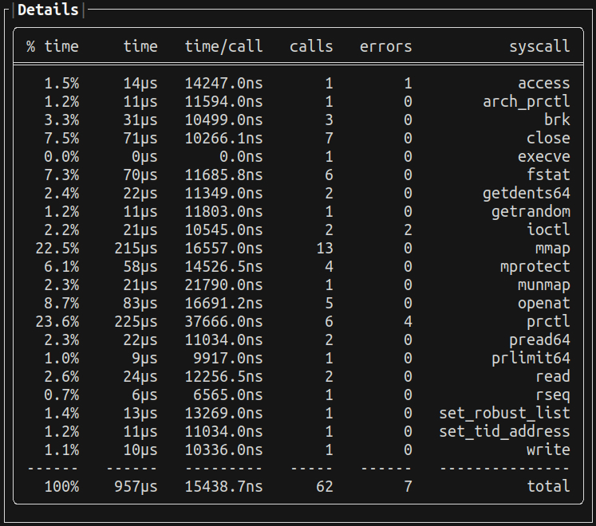

Dynamic analysis is the process of examining the binary file **while** it is running. This is useful for debugging and tracing the execution flow.

For this, `binsider` executes the binary and traces the system calls made by it, similar to the [`strace(1)`](https://man7.org/linux/man-pages/man1/strace.1.html) command.

Simply press <kbd>enter</kbd> to start the dynamic analysis.



:::note[System Calls]

Each line represents a system call with the following format:

```plaintext
[277208] ioctl(1, 21505, 0x7FFFFFFFB900) = -25
├────────┼─────────────┼─────────────────────┤
│        │             │                     │
│        │             │                     │
│        │             │                     └─ Return value of the system call
│        │             │
│        │             └─ Arguments
│        │
│        └─ System call name
│
└─ Process ID
```

:::

You can use the following keys to interact with the dynamic analysis:

| **Key**                     | **Action**           |
| --------------------------- | -------------------- |
| <kbd>j</kbd> / <kbd>k</kbd> | Scroll up/down       |
| <kbd>t</kbd> / <kbd>b</kbd> | Go to the top/bottom |
| <kbd>/</kbd>                | Search for value     |
| <kbd>r</kbd>                | Re-run executable    |
| <kbd>enter</kbd>            | Show details         |

### Details

When you press <kbd>enter</kbd>, you will get a summary output of the execution:



This summary includes the percentage of time spent, time in microseconds, time per call, number of calls, errors, and the corresponding system calls which is useful for understanding the binary's behavior.

---

:::tip[Lurking in the shadows]

Check out the [`lurk`](https://github.com/JakWai01/lurk) project which powers the dynamic analysis feature of `binsider`.

:::
