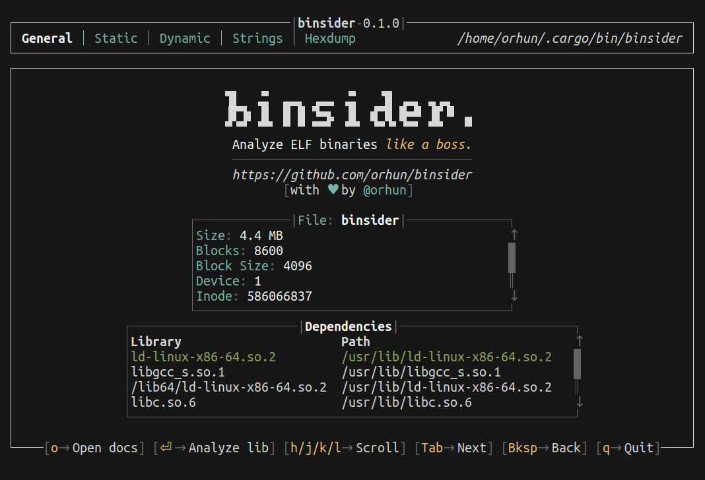
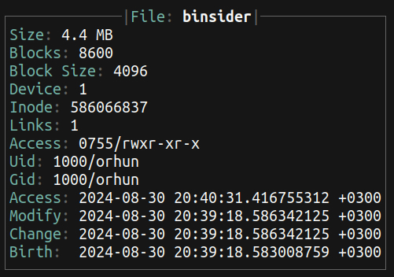
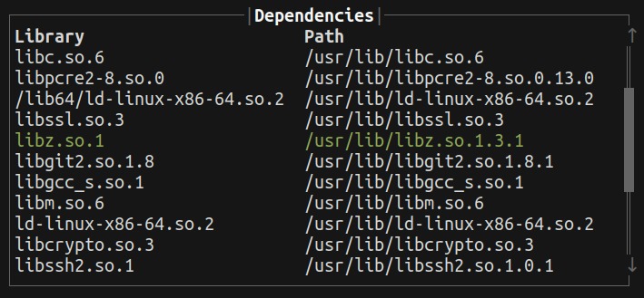
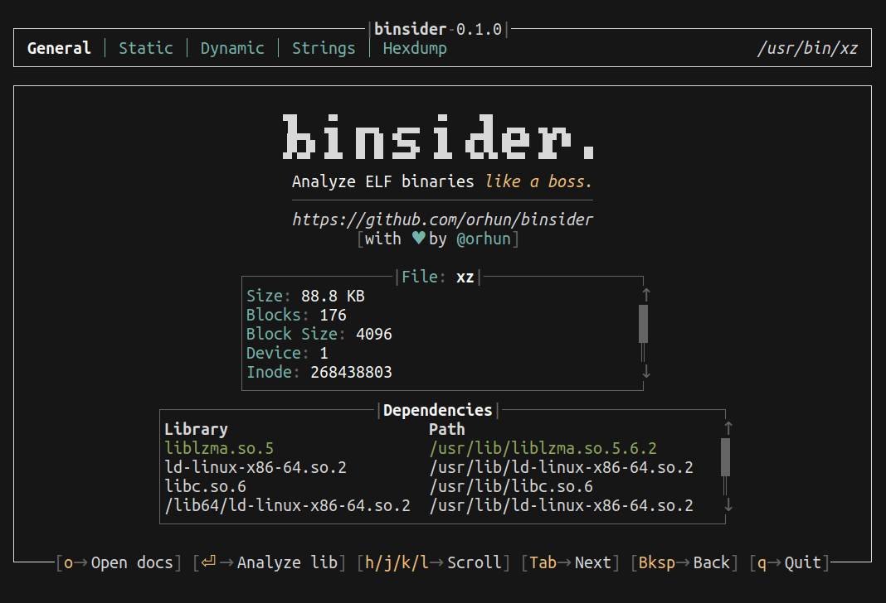

On the startup, you can get a general information about the binary file. This information includes:

- the file size, owner, group, permissions and date information (similar to [`stat(1)`](https://www.man7.org/linux/man-pages/man1/stat.1.html))
- the shared libraries that are linked (similar to [`ldd(1)`](https://www.man7.org/linux/man-pages/man1/ldd.1.html))

---

### File Information

Here is an example information shown in this tab:

You can press <kbd>h</kbd> and <kbd>l</kbd> to scroll vertically.

---

### Linked Shared Libraries

You can press <kbd>enter</kbd> to re-run `binsider` with the selected shared library and <kbd>backspace</kbd> to go back. This means you can not only analyze a single binary but also the linked shared libraries as well.

Here is an example of cycling through the shared libraries of `xz` binary:

You can see the analysis path on the top right corner of the screen:

