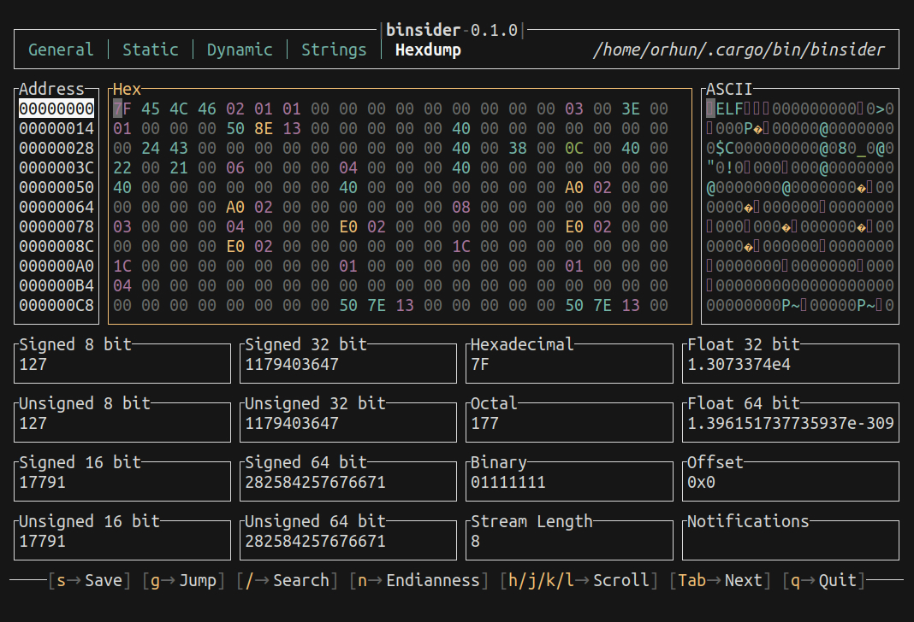
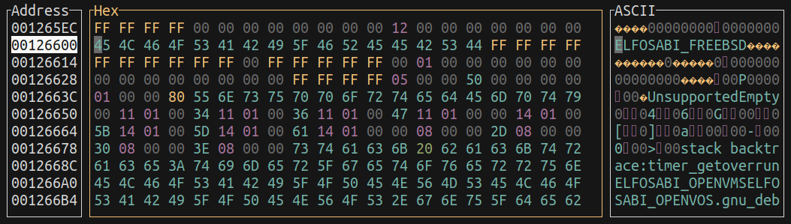

Hexdumping is the process of converting binary data into hexadecimal format. This is useful for understanding the binary's structure and finding patterns in the data.

`binsider` provides a rich dashboard along with a hexdump view to analyze the binary file.

Here is an example of swimming through the hexdump (<kbd>h</kbd>/<kbd>j</kbd>/<kbd>k</kbd>/<kbd>l</kbd>), jumping to a specific byte (<kbd>g</kbd>) and searching for a string (<kbd>/</kbd>):

---

### Modifying Data

You can also modify the hex data and enter new values, very much like an editor.

Simply start typing the new hex values and press <kbd>s</kbd> to save the changes to the binary.

:::danger

Make sure to back up the binary file before making any changes.

:::

:::caution

The binary should be opened in read-write mode for this feature to work.

:::

---

:::tip[heh!]

Check out the [`heh`](https://github.com/ndd7xv/heh) project which powers the hexdump feature of `binsider`.

:::
