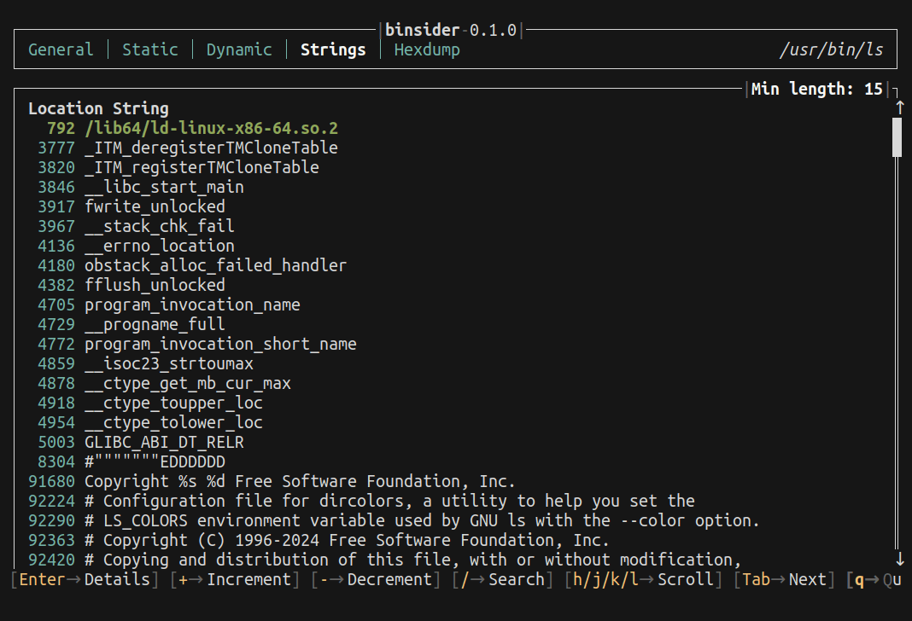

Similar to the [`strings(1)`](https://linux.die.net/man/1/strings) command, `binsider` is able to extract strings from the binary file. This is useful for finding interesting strings such as URLs, passwords, and other sensitive information.

:::tip

You can adjust the length of the strings to be extracted by using the <kbd>+</kbd>/<kbd>-</kbd> keys or running `binsider` with the `-n` argument.

:::

Press <kbd>/</kbd> to search and <kbd>enter</kbd> to view the details.

